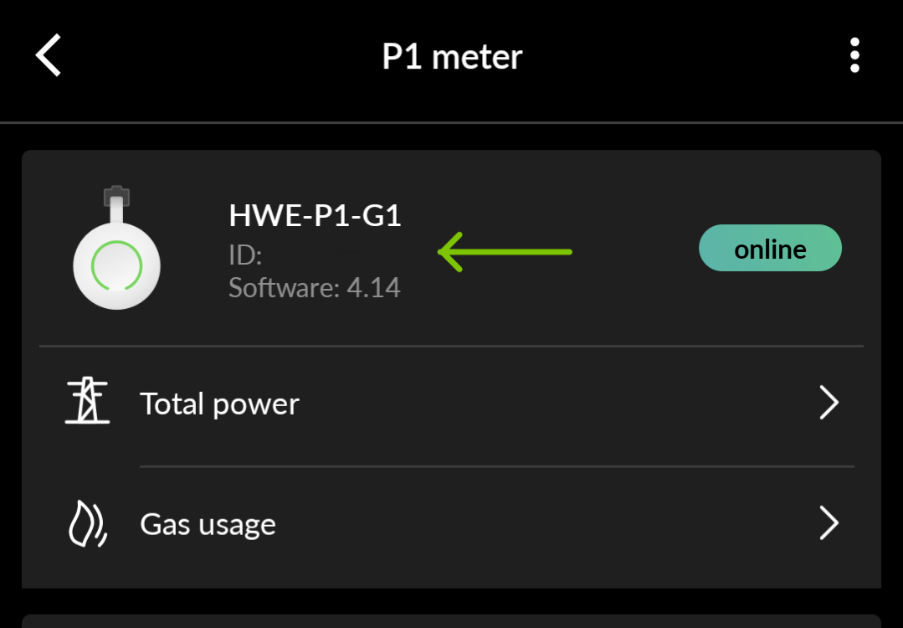

# HW Hooks

[](https://github.com/codespaces/new?machine=basicLinux32gb&repo=612398925&ref=main)


[](https://scorecard.dev/viewer/?uri=github.com/Th3S4mur41/hw-hooks)


**hw-hooks** previously known as [hw2energyid](https://www.npmjs.com/package/hw2energyid) is small tool that triggers webhooks based on data gathered from [HomeWizard](https://www.homewizard.com/) devices to synchonize your data with your r[EnergyID](https://app.energyid.eu/) dashboard.
Since HomeWizard devices API are only available within your local network, using an [EnergyID App](https://app.energyid.eu/integrations) to synchronize the data is not possible.  
**hw-hooks** helps bridge the gap by reading the data from your local network and sending them to EnergyId.

## Prerequisites

### EnergyID

> [!IMPORTANT]
> hw-hooks no longer supports the legacy EnergyID webhook (URL + key). It now uses EnergyID's current [incoming webhook](https://help.energyid.eu/en/developer/incoming-webhooks/), which is claimed interactively on first run. The legacy webhook is being sunset by EnergyID on 30 September 2026.

There is nothing to set up on the EnergyID website beforehand. Just run hw-hooks (see [Usage](#usage) below):

1. On first run, hw-hooks prints a claim URL and a claim code in the console.
2. Open the URL, select the record you want to link the device to (e.g.: Home), and enter the claim code.
3. hw-hooks keeps polling until the device is claimed, then starts sending data.

### Node

To run the tool, you will also need to have [NodeJS](https://nodejs.org/en/download) installed

## Usage

You can either run the tool in the console using the NPM script or use the Docker image.

### NPM Script

Open a terminal/console and run the following script:

```sh
npx hw-hooks --meter=<meter host or ip> <options>
```

The only required option is `--meter`. Everything else is optional: the device id/name/firmware version are read from the meter, and provisioning credentials are generated automatically if not provided. All of these, together with the claimed connection info, are persisted to `config/config.jsonc` so they're reused on subsequent runs.

### Options

| Option                  | Alias            | Optional | Description                                                                            |
| ----------------------- | ---------------- | -------- | -------------------------------------------------------------------------------------- |
| `--meter`               | `-m` `-p` `--p1` | No       | The name or IP address of the Homewizard meter                                         |
| `--provisioning-key`    | `-k`             | Yes      | EnergyID provisioning key (generated and stored if omitted)                            |
| `--provisioning-secret` | `-s`             | Yes      | EnergyID provisioning secret (generated and stored if omitted)                         |
| `--offset`              | `-o`             | Yes      | Add an offset to the meter's value (to compensate for consumption before installation) |
| `--dry-run`             | `-d`             | Yes      | Dry run. No data will be sent to EnergyID                                              |
| `--recurring`           | `-r`             | Yes      | Read the meter every 5 minutes and send following EnergyID's upload interval           |
| `--help`                | `-h`             | Yes      | Show help                                                                              |
| `--version`             | `-v`             | Yes      | Show version number                                                                    |

### Docker

First, you need to retreive the IP address of your Homewizard meter.

> **Note**
>
> The hostname is formatted as <product-name>-<last 6 characters of serial>, so devices with serial AABBCCDDEEFF the hostname is as following:
>
> | Device                   | Example hostname    |
> | ------------------------ | ------------------- |
> | P1 meter                 | p1meter-DDEEFF      |
> | Energy Socket            | energysocket-DDEEFF |
> | Watermeter               | watermeter-DDEEFF   |
> | kWh meter (single phase) | kwhmeter-DDEEFF     |
> | kWh meter (three phase)  | kwhmeter-DDEEFF     |

Open a terminal/console and run the following script:

```sh
ping <product-name>-<last 6 charachter of serial>
```

Create a docker compose file with the following content:

```yaml
version: '3'

services:
  hw-hooks:
    image: ghcr.io/th3s4mur41/hw-hooks
    environment:
      - meter=<the IP address of the Meter device>
    volumes:
      - ./config:/app/config
    network_mode: host
    dns:
      - 1.1.1.1
```

> **Note**  
> The `dns` section is required to resolve the EnergyId webhook URL.
> If you are using a different DNS server, replace

> [!IMPORTANT]  
> Mount `./config:/app/config` so the container's generated provisioning credentials and claimed connection info survive restarts (otherwise the device has to be re-claimed on every restart). This also lets you edit `config/energyid-mapping.json` to customize which meter fields are sent to EnergyID.

On first start, watch the container logs (`docker compose logs -f`) for the claim URL and code, as described in [Prerequisites](#prerequisites).

| Environment Variable  | Optional | Description                                                    |
| --------------------- | -------- | -------------------------------------------------------------- |
| `meter`               | No       | The IP address of the Homewizard meter                         |
| `provisioning_key`    | Yes      | EnergyID provisioning key (generated and stored if omitted)    |
| `provisioning_secret` | Yes      | EnergyID provisioning secret (generated and stored if omitted) |

## Examples

> **Note**  
> hw-hooks currently only supports synchronizing electricity and water readings

### P1 Meter

The HomeWizard [P1 Meter](https://www.homewizard.com/p1-meter/) connects into the P1 port on your smart meter and shows your electricity and gas usage.

The P1 meter can be discoverd on your network using [Multicast DNS (mDNS)](https://www.ionos.com/digitalguide/server/know-how/multicast-dns/).  
The name of the device is 'hw-p1meter-' followed by the last six charachters of its serial number.

> **Note**  
> To find the serial number, open your HomeWizard Energy App.  
> Then go to Settings > Meters > P1 meter
> 

Now that you have all the data you need. Open a terminal/console and run the following script:

```sh
npx hw-hooks --meter=hw-p1meter-<last 6 charachter of serial>
```

E.g.: The command with your data should look similar to this:

```sh
npx hw-hooks --meter=hw-p1meter-65d8c7
```

### Water Meter

The HomeWizard [Water Meter](https://www.homewizard.com/watermeter/) reads your analog water meter.

The Water meter can be discoverd on your network using [Multicast DNS (mDNS)](https://www.ionos.com/digitalguide/server/know-how/multicast-dns/).  
The name of the device is 'watermeter-' followed by the last six charachters of its serial number.

Now that you have all the data you need. Open a terminal/console and run the following script:

```sh
npx hw-hooks --meter=watermeter-<last 6 charachter of serial>
```

E.g.: The command with your data should look similar to this:

```sh
npx hw-hooks --meter=watermeter-65d8c7 --offset=22.334
```

## Links

[homewizard dicovery docs](https://api-documentation.homewizard.com/docs/discovery)  
[EnergyId Webhook Docs](https://help.energyid.eu/en/developer/incoming-webhooks/)
